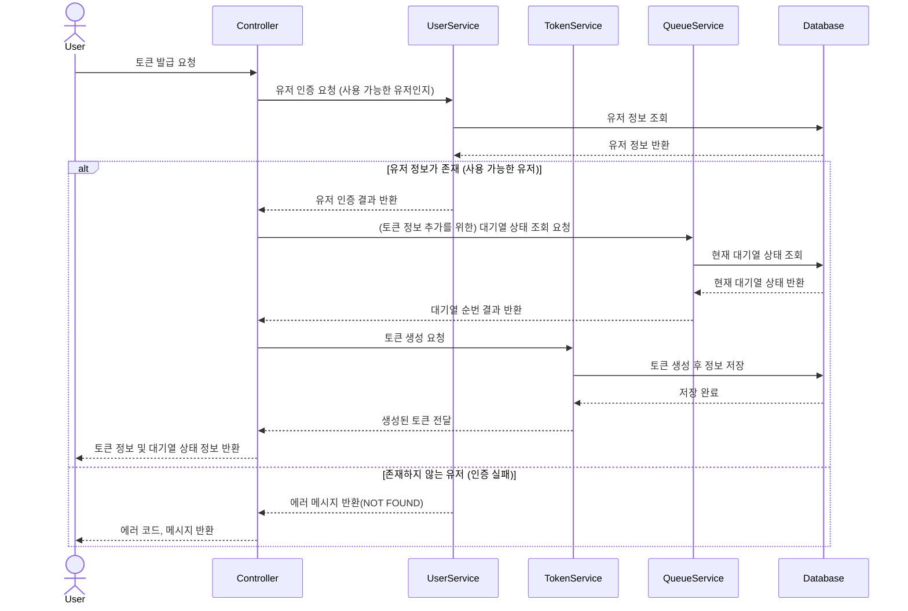
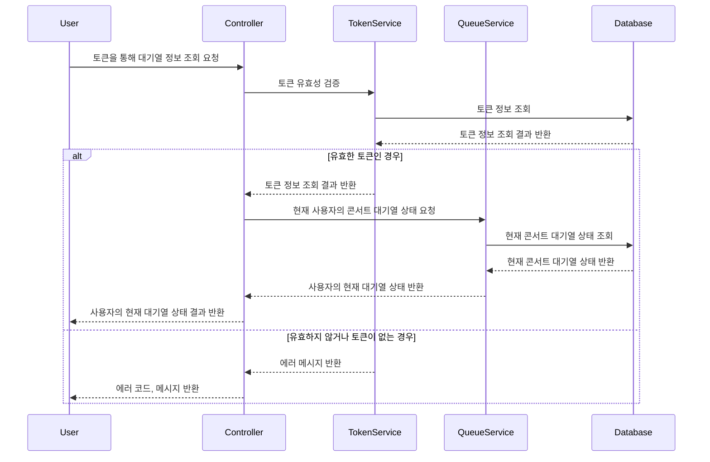
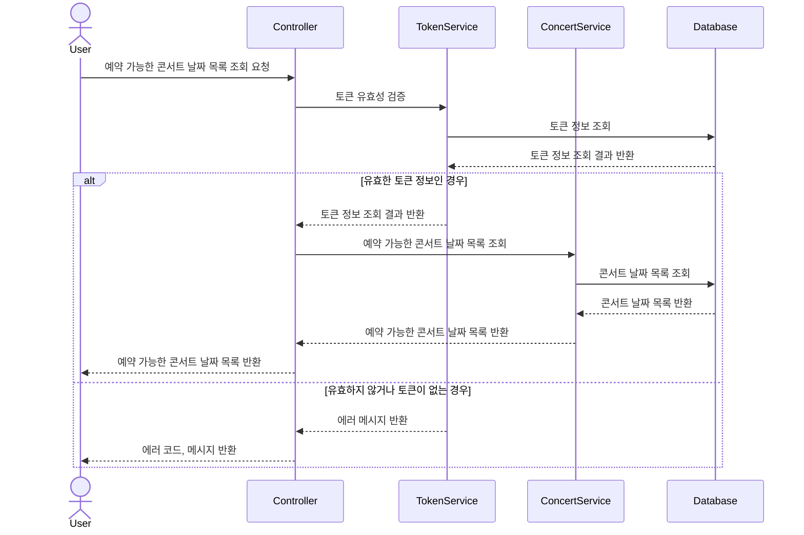
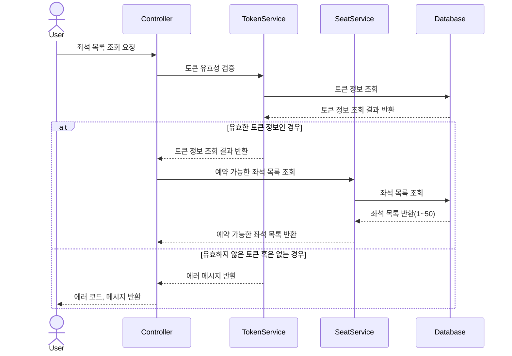
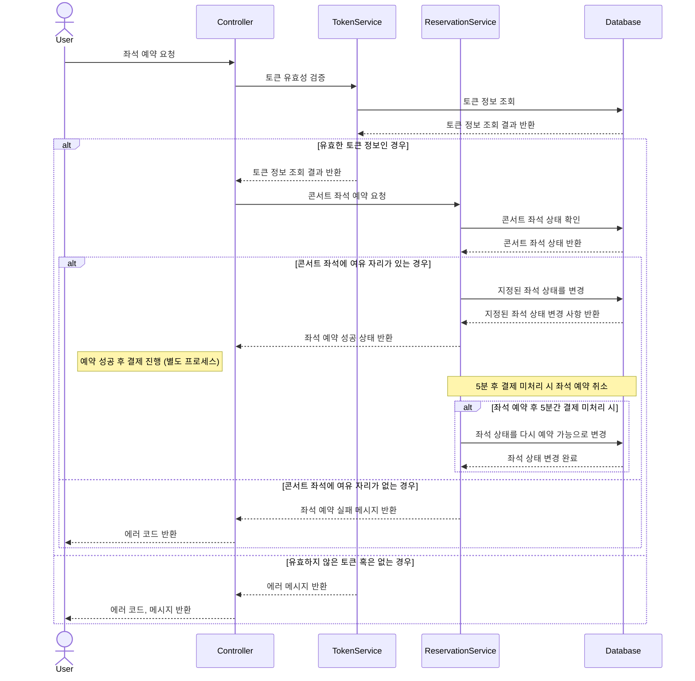
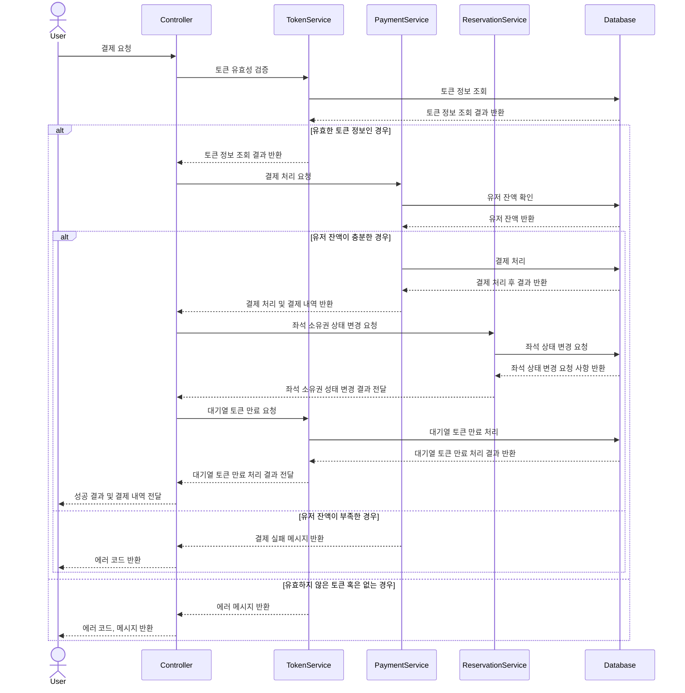
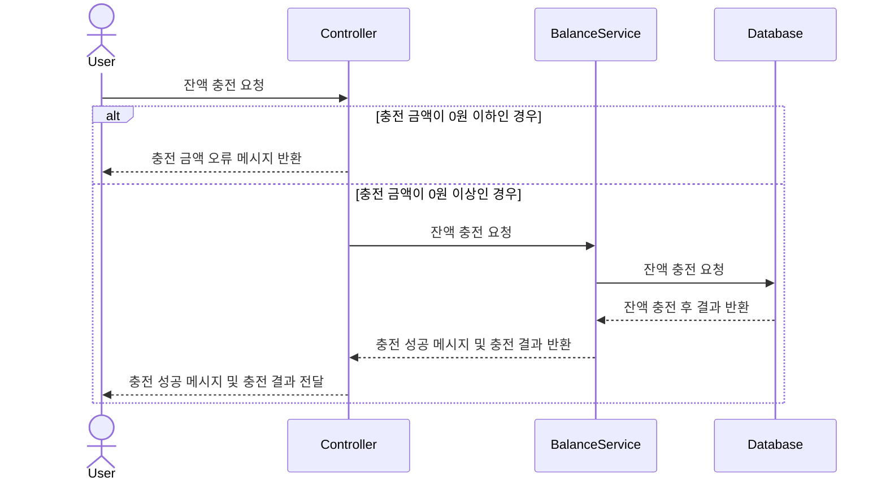
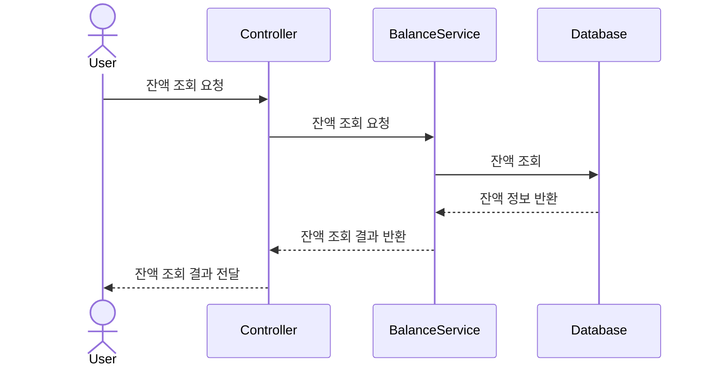

## 1. 유저 토큰 발급

### Sequence Diagram

### Description

유저가 콘서트 예약을 시도할 때, 토큰을 발급받습니다.

현재 대기열의 상태를 조회하여, 토큰 생성을 요청을 하여 DB에 저장하도록 합니다.

생성된 토큰와 대기열의 상태 정보를 반환합니다.

## 2. 유저 토큰을 통한 대기열 정보 조회

### Sequence Diagram

### Description

토큰을 통해 대기열 정보를 조회 합니다.

기본적으로 “폴링” 으로 본인의 대기열을 확인한다고 가정합니다.

## 3. 예약 가능 날짜 목록 조회

### Sequence Diagram

### Description

유저 토큰이 유효한지 검사합니다.

토큰이 유효하다면, 선택한 콘서트가 진행되는 날짜 목록을 조회 합니다.

그 중, 예약이 가능한 날짜 목록을 사용자에게 반환하도록 합니다.

그러나, 토큰이 유효하지 않거나 없는 경우에는 예외를 반환합니다.

## 4. 좌석 정보 조회

### Sequence Diagram

### Description

유저 토큰이 유효한지 검사합니다.

토큰이 유효하다면, 해당 콘서트가 열리는 날짜의 예약 가능한 좌석 목록을 조회합니다.(좌석 정보는 1~50 까지 좌석 번호로 관리 됩니다)

이후 사용자에게 예약 가능한 좌석 정보를 반환합니다.

## 5. 좌석 예약

### Sequence Diagram

### Description

유저 토큰이 유효한지 검사합니다.

토큰이 유효하다면, 예약 가능한 날짜의 콘서트 좌석 상태를 확인합니다.

해당 좌석이 예약이 가능하다면 예약 정보를 저장하고, 좌석 상태를 임시 예약 상태로 변경합니다.

임시 예약 상태로 변경 후 결제 프로세스를 진행합니다. (이는 별도로 진행합니다.)

임시 예약 상태 이후 5분이 지났음에도 결제가 이루어지지 않은경우, 스케줄러를 통해 좌석 상태를 다시 변경해두도록합니다.(임시 예약 -> 예약 가능)

좌석이 예약 불가능한경우 예약 실패 메세지를 유저에게 반환합니다.

## 6. 결제

### Sequence Diagram

### Description

유저 토큰이 유효한지 검사합니다.

토큰이 유효하다면, 유저 잔액 정보를 먼저 확인합니다.

유저 잔액이 충분한 경우 결제 처리를 진행합니다.

결제에 성공하면 좌석의 상태를 결제 완료로 변경합니다.

또한, 대기열 토큰을 만료 시킵니다.

사용자에게는 성공 결과 및 결재 내역을 같이 전달합니다.

## 7. 잔액 충전

### Sequence Diagram

### Description

잔액 충전과 조회는 유저 토큰 검증이 불필요합니다.

충전 금액을 확인하여 0원 이상인 경우에만 잔액 충전을 진행하도록 합니다.

잔액 충전이 성공하면 총 잔액 결과를 반환합니다.

## 8. 잔액 조회

### Sequence Diagram

### Description

잔액 충전과 조회는 유저 토큰 검증이 불필요합니다.

유저의 현재 잔액을 조회합니다.
