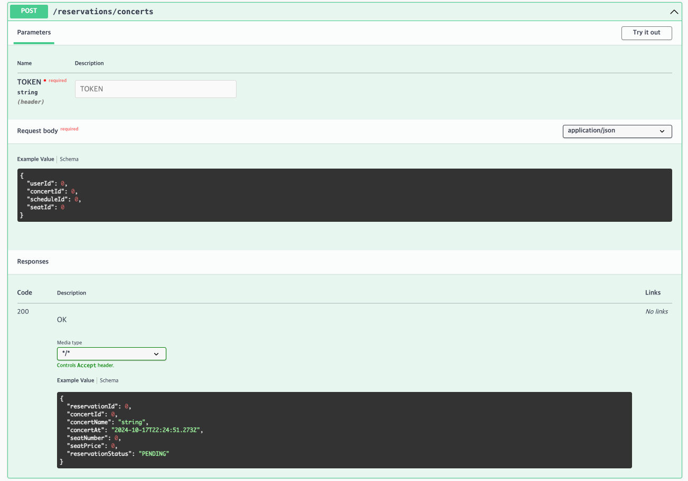
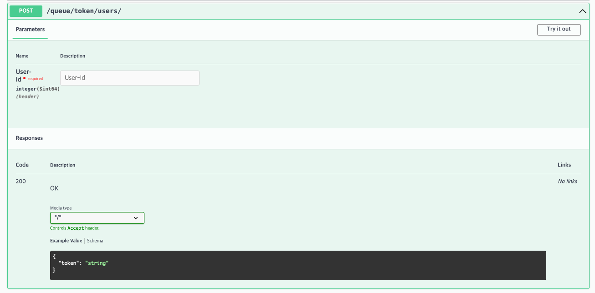
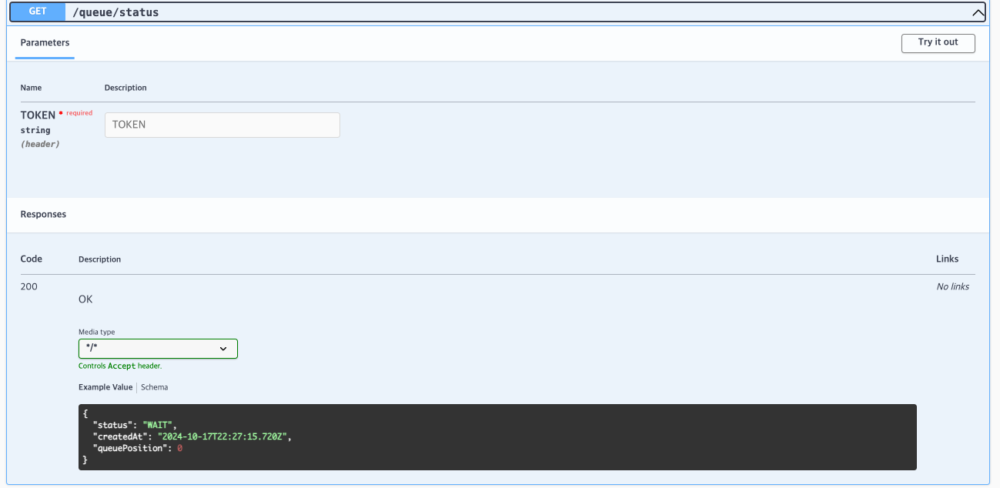
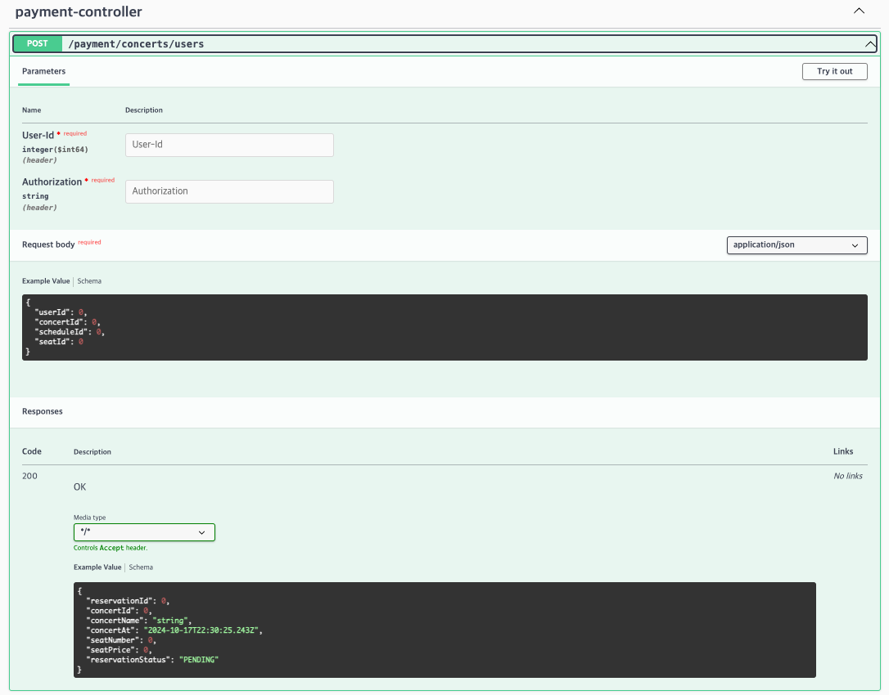
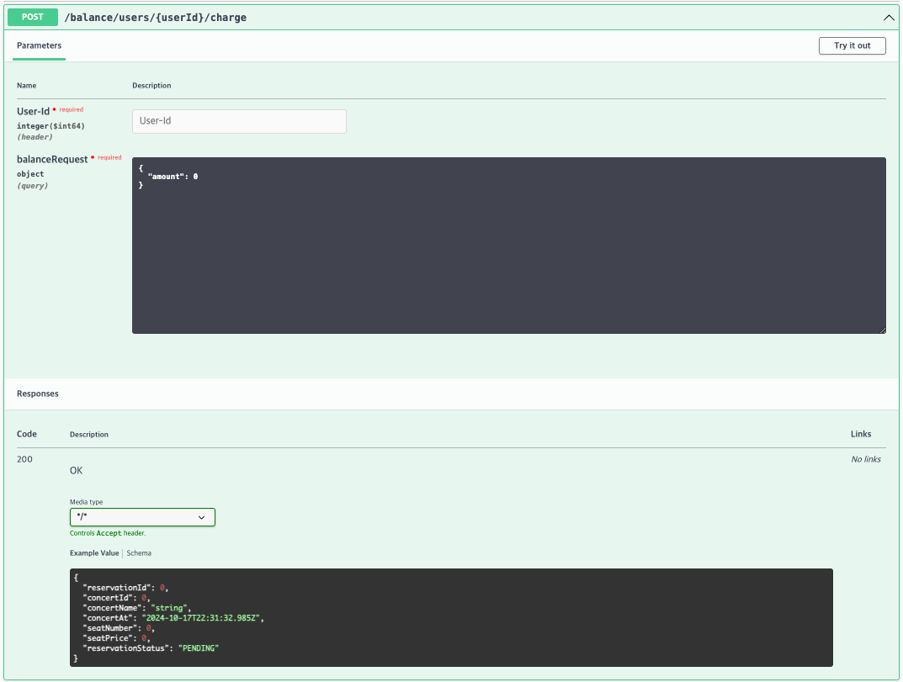
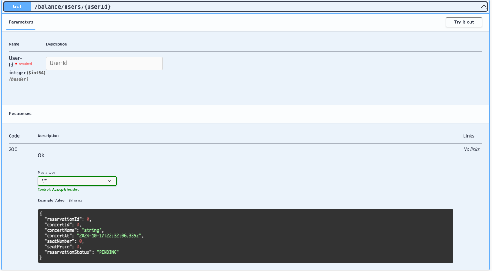
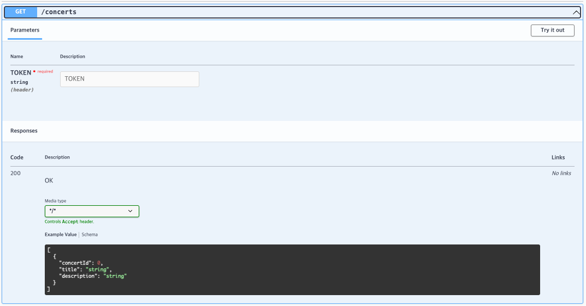
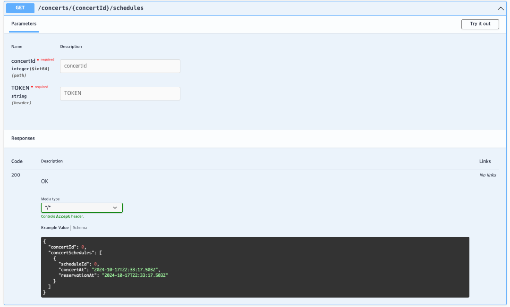
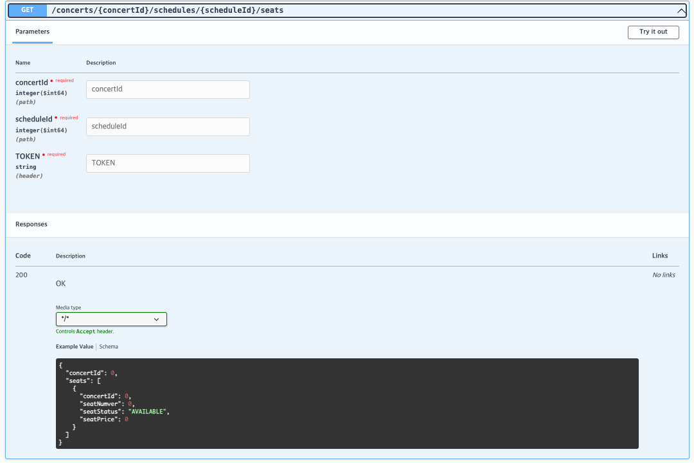

# Swagger API 문서

## Reservation API (콘서트 예약 API)

---

## Queue API (대기열 토큰 API)

### 대기열을 저장하고 토큰을 발급해주는 API

### 현재 대기열의 상태를 조회하는 API

---

## Payment API (결제 API)

---

## Balance API (잔액 API)

### 잔액 충전 API

### 잔액 조회 API

---

## Concert API (콘서트 API)

### 예약 가능한 콘서트들을 조회하는 API

### 선택한 콘서트의 예약 가능한 날짜 목록을 조회하는 API

### 선택한 콘서트와 날짜의 예약 가능한 좌석을 조회하는 API

